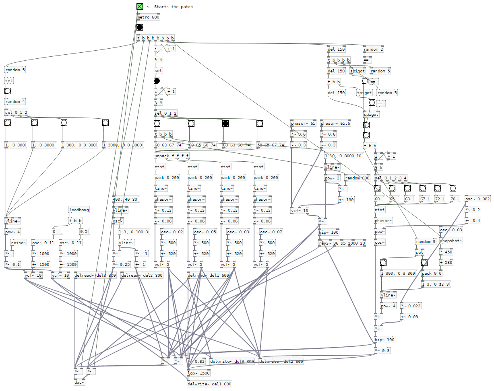

### Patch recreation

# Background Task 01a by Delta Sign

Original:
[Patch](https://forum.pdpatchrepo.info/topic/11405/a-vanilla-patch-i-made-while-browsing-the-internet),
[Notes](https://www.reddit.com/r/puredata/comments/8nf4ct/a_vanilla_patch_i_made_while_browsing_the_internet/),
[Audio](https://soundcloud.com/deltasign/background-task-01a)

Pure Data Screenshot:

Author's notes:

> A silly little Vanilla Pure Data patch I made while browsing the internet. I
> just left it running in the background, came back to it to change a few
> things, left it running while browsing again...
>
> Just adding one element at a time makes things a lot easier. The few elements
> in this patch are really, really simple. It's really just a bunch of filtered
> saws, a super basic kick, an FM synth and some noise.
>
> > And how'd you make that 'reversed' sounding noise?
>
> It's the message boxes on the left. They define the times of the amp envelope
> of the noise. Every time the noise gets triggered, one of the message boxes is
> randomly choosen. Two of them are just decay envelopes, and two of them have
> long attack times, which makes them sound "reverse.
>
> Look at the third message box from the left, it's literally the first one from
> the left in reverse. One of them decays for 300ms, the other one ramps up for
> 300ms.
>
> > How does [sel] work when it has no arguments?
>
> It's the same as "sel 0", I'm just lazy. No argument usually assumes 0. 0
> bangs the left output, and everything else bangs the right output. That's
> great for probabilities. Pair it with a "random 20" object for example and the
> left output of the sel object will bang 5% of the time and the right one the
> other 95%.
