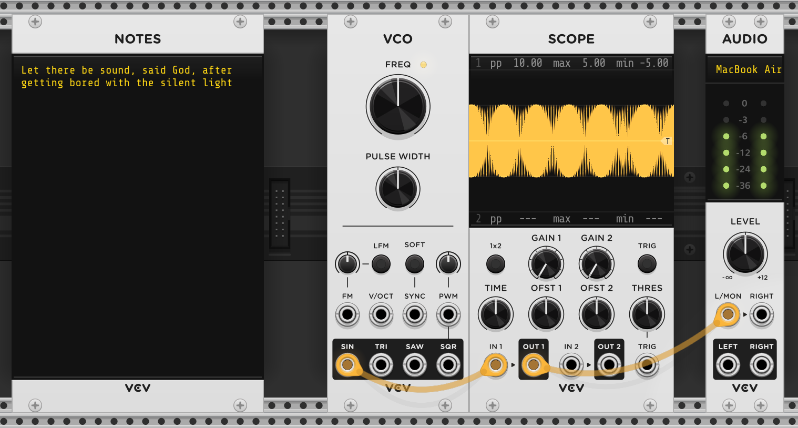
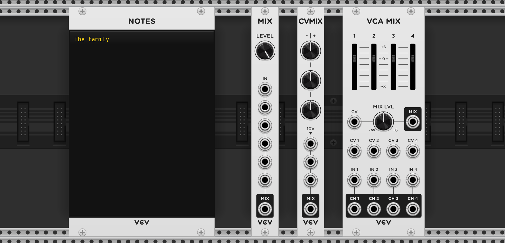
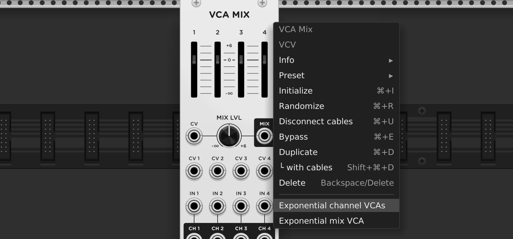
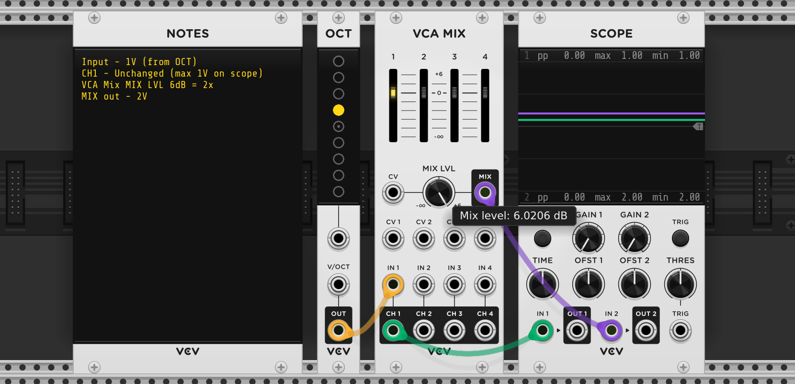
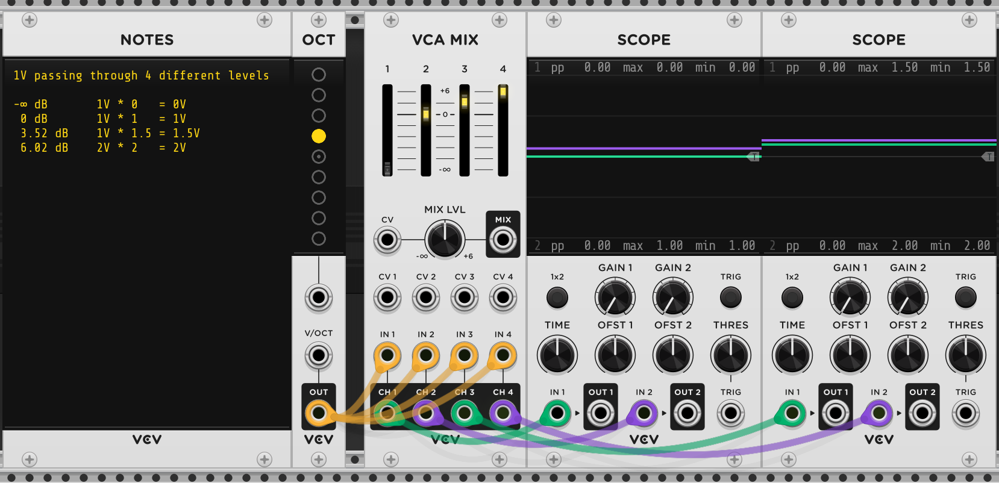
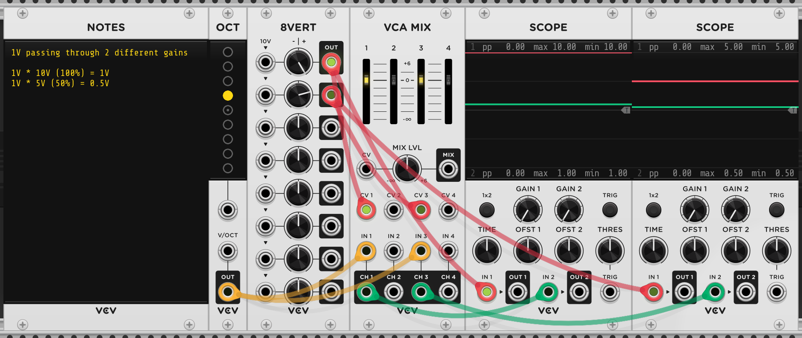
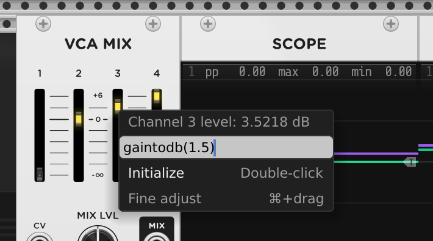
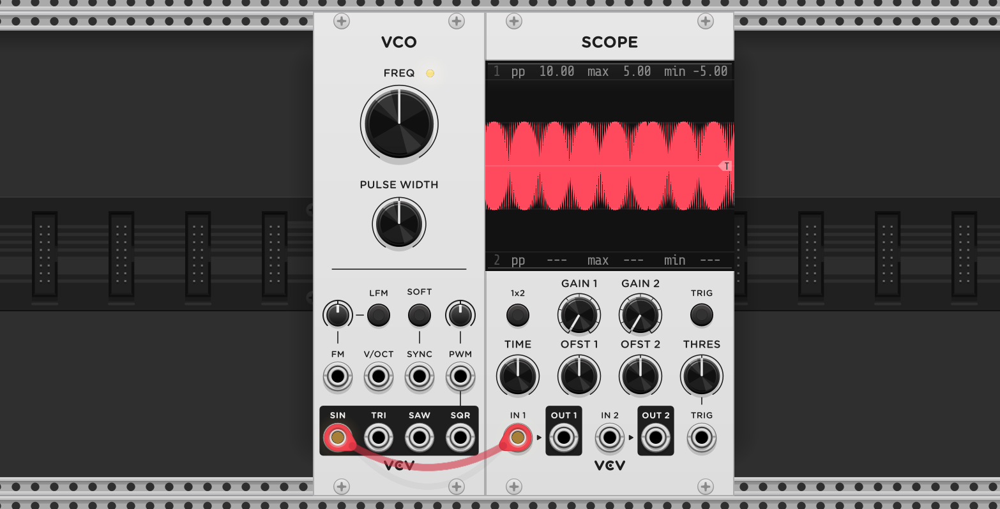
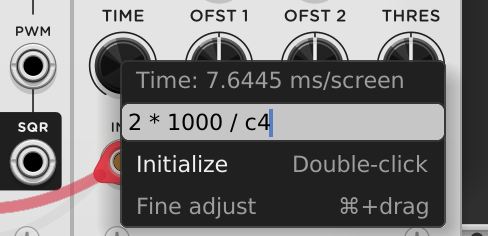

**Part Deux**

# M for Modules

[Audio](#audio) • [Poly](#poly) • [VCA Mix](#vca-mix) • [VCO](#vco)

## Audio

VCV Rack comes with stock modules of two types.

1. Core modules are modules that are included in VCV Rack itself because they
  deal with I/O (audio and MIDI).

2. Fundamental modules are modules provided by the Fundamental plugin that also
   comes with VCV Rack.

This walkthrough is a tour of the Fundamental modules, but from the first
category there is one, and only one, that we will need for our purposes: Audio
(or more specifically, Audio 2).

All it does is send its input out through
your speakers. Might be useful.

> [!TIP]
>
> Actually, there is another core module that we've been using all along, to
> scribble our graffiti on. Notes!

The (virtual) voltages travelling in the cables between modules in Rack can be
anything a float can hold (~±1038 in magnitude though not in
precision), but individual modules can (and sometimes do) choose to clip their
inputs or outputs.

In particular, Audio clamps the values it gets to lie between ±10V, and then
rescales them them to ±1 before sending them out to device.

## Poly

So far we've talked of voltages as real numbers carried by a cables, but cables
can also carry vectors! Such cables are called **Polyphonic cables**, and the
vectors they carry can be of length up to 16.

All the operations that the stock modules are doing can also be done on these
entire vectors in one go.

The modules **Merge**, **Split**, **Sum** and **Viz** are for converting normal
cables into polyphonic ones (or vice versa) and visualizing their contents.

> [!TIP]
>
> When starting out, for a while we can just pretend these don't exist, to
> reduce the number of modules in our palette.

## VCA Mix

After that brief break to talk about Audio and Poly, let us get back to where we
were: VCA.

What happens when you put four VCAs together? Well, you get the VCA Mix.

That's one way of looking at it: 4 x VCA = VCA Mix. But we can arrive at it from
a different direction too:

* Mix was for unity mixing 8 signals, with only a manual control for the output level.

* CV Mix was for mixing 3 signals, with only a manual control for their respective
  input levels.

* VCA Mix is the granddaddy. It can unity mix 4 signals, with manual level
  control _and_ CV controllable gain for each input, outputs for the 4 signals
  after this gain staging, a manual level control and CV controllable gain
  control for the output, and the output after the mix.

> [!TIP]
>
> Another way to think of the VCA Mix is as collection of _five_ VCAs. Four
> VCAs, one per input, summed together by an internal mixer, and then put
> through the output VCA.
>
> All these five VCAs expose all the functionality that the hypothetical
> individual VCA would've, including the ability to toggle the "Exponential
> response" modes. The right click menu for the VCA Mix allows enabling this
> exponential response mode for all four input VCAs ("Exponential channel VCAs")
> simultaneously, and / or for the output VCA ("Exponential mix VCA").
>
> 

Since VCA Mix part of both the mixer family and the audio family, the
terminology on its panel is also different from the CV-ish modules we've seen so
far.

* The four inputs (_IN 1_, _IN 2_, _IN 3_ and _IN 4_), after being multiplied by
  the corresponding manual level and gain input (_CV N_), are named as
  "channels" (_CH N_).

* The CV (gain) input ranges are the same as the VCA - 0 (0%) to 10V (100%) -
  but the manual level knobs both labelled differently, and have more range.

Here are the markings translated to their numeric multiplier:

| Label (dB) | Gain (multiplier) |
|------------|-------------------|
| -∞         | 0                 |
| 0          | 1                 |
| 6          | 2                 |

The markings alongside the faders also work as one would expect. For example,
placing the fader roughly at the halfway marker between 0 dB and 6 dB gives us a
gain of 1.5x.

If you don't understand decibels etc, do not worry, it is not going to get in
your way. The CV (gain) inputs still behave like plain VCA.

The level faders and mix knob using the dB scale is likely because the VCA is
meant for audio voltages, where the dB scale better matches our perception of
"volume" / loudness. In most cases, and unlike the CV inputs, these faders will
be adjusted by "ear", so you wouldn't need to know what the numbers are or mean,
and by using a dB scale they'll behave similar to the volume knobs you might be
used to from the real world.

> [!TIP]
>
> If you want to set them to exact values, you can use the `gaintodb(x)`
> function to convert a gain to its dB equivalent. You can enter it directly in
> the text field that appears on right clicking the fader or knob.
>
> 

## VCO

Eventually, after doing all the maths and whatnot, what want our music making
machine to do make music, and half of music is sound.

> [!TIP]
>
> The other half is silence.

So we need to make sounds. There are only two ways to generate a sound in Rack
(if we restrict ourselves to the stock modules) - Using an oscillator, and using
noise.

> [!TIP]
>
> This might not seem much, these two cover the entire gamut of phenomena:
>
> - Repeating the same thing again and again - an oscillator;
> - Never repeating the same thing again - noise.
>
> The music in modular setups arises not from the richness of sound sources but
> from the way that everything is modulatable, including the modulators (these
> two primitives).
>
> Usually, we want something in the middle of these two extremes - repeating
> something in "musical" variations - and that ability is provided by a
> sequencer which we'll come to in due time.

There are many oscillators (we'll come to noise later), and the distinctions
between them, while important, are just the 2%. By focusing on the distinctions
too early, we risk not paying attention to the 98% of them which is the same.

An oscillator produces a repeating waveform. The canonical repeating waveform is
a sine wave.

By default, the sine wave repeats 261.6256 times per second. Why such an oddly
specific number? When something repeats this many times per second, it is by
convention called as a pitch C, specifically, C4 (the "middle" C on the piano,
or the 5th fret on the fourth string from the top of the guitar).

> [!TIP]
>
> Don't worry about it or what it means too much. Something had to be made the
> default, and this is just a convenient choice.

Repeating 261.6256 times per second means that each repetition will take 1 /
261.6256 seconds, or ~3.8 milliseconds. The smallest time resolution for the
scope is 5 milliseconds, so if we set the scope _TIME_ to 2 * 1000 / c4, or ~
7.6 milliseconds, we should be able to see two cycles of the sine wave pass
through.

> [!TIP]
>
> We can directly enter that expression in the text field on the parameter right
> click context menu for the _TIME_ knob on Scope.
>
> 

---

[← Part 1](../)
