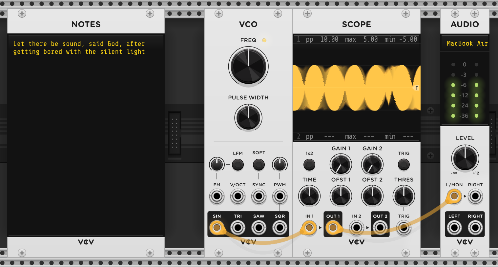

# M for Modules

[8vert](#8vert) • [Oct](#oct) • [Mix](#mix) • [Audio](#audio)

## 8vert

8vert outputs 10V,


As many times as you want.


Not just 10V, but anything you want.


As much of it as you want,


Phase shifted if you want.


Of many kinds if you want.


8vert can output any volts, not 10 if you want.


8 attenuverters make 8vert, making this the 8th fact about it, and let's move
on.

## Oct

Oct outputs 1V.


But it can also output 4.


And it can also output 8.


The octave shift (the yellow dot, plus the first input jack) will be literally
added to the "input" (second jack). That's all that Octave does.


Don't believe me? [Read the source](https://github.com/VCVRack/Fundamental/blob/d1c9f6f1fe7e2f2f1fa85cf2da3ac798b86ed2de/src/Octave.cpp#L41)!

```cpp
int octave = octaveParam              /* yellow dot in the panel */
           + round(inputs[OCTAVE].voltage) /* voltage of first jack */
float pitch = inputs[PITCH].voltage   /* voltage of second jack */
pitch += octave                       /* The "magic" */
output[PITCH].voltage = pitch;        /* voltage of third (output) jack */
```

## Mix

Mix adds voltages.


8vert and Oct both allow us to create constant voltages, including 1. Oct allows
us to add a constant voltage to a (variable) voltage. We have all the Peano
axioms we need recreate arithmetic, but it did take Russell & Whitehead 300
pages to define plus. Who has time for 300 pages these days, we want our
addition, we want it now.

Mix allows us to add two variable voltages, completing the triad.

| Rack  | Math  |
|-------|-------|
| 8vert | 1     |
| Oct†  | 1 + a |
| Mix   | a + a |

<small>† Oct also allows us to add two variable ones, if we're okay with
rounding one of them. Although one man's rounding is another man's
quantizer...</small>

But if we just want to add the same thing to itself, we don't necessarily need
to duplicate it, we can just drag _two_ cables from the output jack to the
inputs.


This ability, called **Stackable outputs**, allows us to stack multiple cables
on an output jack (or "ports", as Rack calls them). Which leads one to wonder:
can we stack multiple cables on an input? Can we have **Stackable inputs**?

We can. And it does what you'd expect it to - it'll add all the voltages up.


> <small> For those wondering, no, we can't drag two cables from the same output
> to the same input. </small>

So both of them doing the exact same thing? Yes. This is how [stackable
inputs](https://github.com/VCVRack/Rack/blob/4a7ad1e1e781f2e858e2c8b04867e9665fecc1f1/src/engine/Engine.cpp#L383-L401)
do their thing:

```py
for (each cable of cables)
    inputVoltage += cable.outputVoltage
```

while this is how
[Mix](https://github.com/VCVRack/Fundamental/blob/d1c9f6f1fe7e2f2f1fa85cf2da3ac798b86ed2de/src/Mixer.cpp#L58-L61)
does it:

```cpp
for (int i = 0; i < 6; i++)
    outputVoltage += inputs[i].voltage
```

So both are literally adding all the inputs voltages up. This is what is
sometimes referred to as a "unity mix" - the inputs are added up without any
gain or attenuation (i.e. with _unit_ gain) applied to them or to the result.
This is useful behaviour for various semantics that might be attached to the
voltages under consideration:

* For audio signals we get an equally weighted mix of all the input sounds.

* For CVs this linear combination allows each input to equally offset the
  modulated parameter (note that voltages can be negative too).

* For 1V/oct pitches, the notes are transposed.

* For gates, it emulates a logical "OR" - the output gate is "on" whenever any
  of the input gates are.

Mix is still useful though.

For starters, stacking cables on an input port to add their voltages up, while
convenient, can make patches "harder to read". Using a Mix is more explicit,
though detractors will say it makes patches more "verbose". Programming language
syntax debates are not limited to text.

Secondly, Mix allows us to set the output level. That is, after adding all the
inputs up, it can attenuate the result before setting the voltage on the output
jack.


It allows us to multiply a voltage by -1 (Right click, "invert output").


Not
sure how this new operator (`f(x) = x * -1`) adds to our Peano arithmetic, but when
applied to a control voltage, this will reverse its effect, while for an audio
signal, it will invert its phase.

In the last sentence, notice the different semantic effect multiplying by -1 has
on the voltage. The code is literally [multiplying by
-1](https://github.com/VCVRack/Fundamental/blob/d1c9f6f1fe7e2f2f1fa85cf2da3ac798b86ed2de/src/Mixer.cpp#L48):

```cpp
if (invert)
    gain *= -1;
```

but it does different things depending on what the cable is carrying. In most
cases, the conventions around what the voltages in the cable mean, and the
operations we can do to them using modules, have evolved so that the effect will
be something useful, but there is nothing guaranteeing it. For example, if cable
is carrying a gate, then inverting it is usually not going to be what we want.

Anyways, so both these things - changing the output level, including inverting
it - can already be done by an 8vert. Maybe a Mix is more convenient, but it
isn't doing something we already cannot, right?

> [!TIP]
>
> Our attempt at factoring out functionality is only to gain familiarity with
> these modules, but in practice there are many ways to cut the cake. Factors
> like ergonomics, rack space, and the context in which a operation is needed:
> all these give rise to modules that are not "one way to do things" building
> blocks but chimeras with overlap in functionality.

Turns out, Mix does have a new trick up its sleeve - it allows averaging the
inputs.


This is handy for CV, since then the output modulation is in the same range as
the input modulations.

## Audio

VCV Rack comes with stock modules of two types.

1. Core modules are modules that are included in VCV Rack itself because they
  deal with I/O (audio and MIDI).

2. Fundamental modules are modules provided by the Fundamental plugin that also
   comes with VCV Rack.

This document is a tour of the Fundamental modules, but from the first category
there is one, and only one, that we will need for our purposes.

Audio (or more specifically, Audio 2). All it does is send its input out through
your speakers. Might be useful.




> [!TIP]
>
> Actually, there is another core module that we've been using all along, to
> scribble our graffiti on. Notes!
