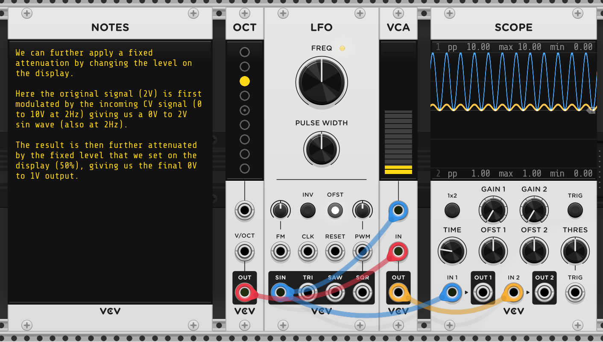

# M for Modules

[8vert](#8vert) • [Oct](#oct) • [Mix](#mix) • [CV Mix](#cv-mix) • [VCA](#vca) • [VCA Mix](#vca-mix) • [Audio](#audio) • [Poly](#poly)

## 8vert

8vert outputs 10V,


As many times as you want.


Not just 10V, but anything you want.


As much of it as you want,


Phase shifted if you want.


Of many kinds if you want.


8vert can output any volts, not 10 if you want.


8 attenuverters make 8vert, making this the 8th fact about it, and let's move
on.

## Oct

Oct outputs 1V.


But it can also output 4.


And it can also output 8. The octave shift itself can be modulated!


The octave shift (the yellow dot, plus the first input jack) will be literally
added to the "input" (second jack). That's all that Octave does.


Don't believe me? [Read the source](https://github.com/VCVRack/Fundamental/blob/d1c9f6f1fe7e2f2f1fa85cf2da3ac798b86ed2de/src/Octave.cpp#L41)!

```cpp
int octave = octaveParam              /* yellow dot in the panel */
           + round(inputs[OCTAVE].voltage) /* voltage of first jack */
float pitch = inputs[PITCH].voltage   /* voltage of second jack */
pitch += octave                       /* The "magic" */
output[PITCH].voltage = pitch;        /* voltage of third (output) jack */
```

## Mix

Mix adds voltages.


8vert and Oct both allow us to create constant voltages, in particular 1. Oct
allows us to add a constant voltage to a (variable) voltage. We have all the
Peano axioms we need recreate arithmetic!

But it did take Russell & Whitehead 300 pages to define "+" if they started with
just 1 and the successor function. Who has time for 300 pages these days; we
want our addition, and we want it now.

Mix allows us to add two variable voltages, completing the triad without
resorting to recreating arithmetic.

| Rack  | Math  |
|-------|-------|
| 8vert | 1     |
| Oct†  | 1 + a |
| Mix   | a + a |

<small>† Oct also allows us to add two variable ones, if we're okay with
rounding one of them. Although one man's rounding is another man's
quantizer...</small>

But if we just want to add the same thing to itself, we don't necessarily need
to duplicate it, we can just drag _two_ cables from the output jack to the
inputs.


This ability, called **Stackable outputs**, allows us to stack multiple cables
on an output jack (or "ports", as Rack calls them). Which leads one to wonder:
can we stack multiple cables on an input? Can we have **Stackable inputs**?

We can. And it does what you'd expect it to - it'll add all the voltages up.


> <small> For those wondering, no, we can't drag two cables from the same output
> to the same input. </small>

So both of them doing the exact same thing? Yes. This is how [stackable
inputs](https://github.com/VCVRack/Rack/blob/4a7ad1e1e781f2e858e2c8b04867e9665fecc1f1/src/engine/Engine.cpp#L383-L401)
do their thing:

```py
for (each cable of cables)
    inputVoltage += cable.outputVoltage
```

while this is how
[Mix](https://github.com/VCVRack/Fundamental/blob/d1c9f6f1fe7e2f2f1fa85cf2da3ac798b86ed2de/src/Mixer.cpp#L58-L61)
does it:

```cpp
for (int i = 0; i < 6; i++)
    outputVoltage += inputs[i].voltage
```

So both are literally adding all the inputs voltages up. This is what is
sometimes referred to as a "unity mix" - the inputs are added up without any
gain or attenuation (i.e. with _unit_ gain) applied to them or to the result.
This is useful behaviour for various semantics that might be attached to the
voltages under consideration:

* For audio signals we get an equally weighted mix of all the input sounds.

* For CVs this linear combination allows each input to equally offset the
  modulated parameter (note that voltages can be negative too).

* For 1V/oct pitches, the notes are transposed.

* For gates, it emulates a logical "OR" - the output gate is "on" whenever any
  of the input gates are.

Mix is still useful though.

For starters, stacking cables on an input port to add their voltages up, while
convenient, can make patches "harder to read". Using a Mix is more explicit,
though detractors will say it makes patches more "verbose". Programming language
syntax debates are not limited to text.

Secondly, Mix allows us to set the output level. That is, after adding all the
inputs up, it can attenuate the result before setting the voltage on the output
jack.


It allows us to multiply a voltage by -1 (Right click, "invert output").


Not
sure how this new operator (`f(x) = x * -1`) adds to our Peano arithmetic, but when
applied to a control voltage, this will reverse its effect, while for an audio
signal, it will invert its phase.

In the last sentence, notice the different semantic effect multiplying by -1 has
on the voltage. The code is literally [multiplying by
-1](https://github.com/VCVRack/Fundamental/blob/d1c9f6f1fe7e2f2f1fa85cf2da3ac798b86ed2de/src/Mixer.cpp#L48):

```cpp
if (invert)
    gain *= -1;
```

but it does different things depending on what the cable is carrying. In most
cases, the conventions around what the voltages in the cable mean, and the
operations we can do to them using modules, have evolved so that the effect will
be something useful, but there is nothing guaranteeing it. For example, if cable
is carrying a gate, then inverting it is usually not going to be what we want.

Anyways, so both these things - changing the output level, including inverting
it - can already be done by an 8vert. Maybe a Mix is more convenient, but it
isn't doing something we already cannot, right?

> [!TIP]
>
> Our attempt at factoring out functionality is only to gain familiarity with
> these modules, but in practice there are many ways to cut the cake. Factors
> like ergonomics, rack space, and the context in which a operation is needed:
> all these give rise to modules that are not "one way to do things" building
> blocks but chimeras with overlap in functionality.

Turns out, Mix does have a new trick up its sleeve - it allows averaging the
inputs.


This is handy for CV, since then the output modulation is in the same range as
the input modulations.

## CV Mix

CV Mix also outputs 10V.


But unlike 8vert, the inputs don't ladder through, but each input gets its own
independent 10V.


In the above example, the first input to CV mix is getting 1V from the Oct. The
second and third inputs are 10V, but since the second level knob is at 0, none
of that goes through. The third knob is at 50%, so 5V (50% of 10V) goes through.
The output of CV Mix is then the sum of all three scaled inputs, 1V + 0V + 5V,
which we can see in the scope.

OTOH, for the 8vert, the first input is 1V, overriding the default 10V, for
itself and all the inputs below, so the (second) output is also 1V.

> [!TIP]
>
> The interface for the modules indicates these distinctions: notice how the the
> CV Mix has a single line indicating independent 10V supplies in the unpatched
> state for all inputs, while the 8vert arrows indicate the cascade between
> successive inputs, with only the first one getting a 10V.
>
> 

So CV Mix is like Mix in that it sums its inputs, but also like 8vert in that it
allows us to "attenuvert" (attenuate and/or invert) the inputs before they get
summed, and like 8vert also provides a default value 10V for unpatched inputs.


Or to put it the other way around, CV Mix provides input level control unlike
Mix which provides output level control; and CV Mix provides a single summed
output unlike 8vert which provides 8 independent outputs.

#### Why "CV"?

CV Mix also works with audio, despite its name. Or does it?

If we patch an audio mix through it, and through a combination of 8vert and Mix,
we seem to get the same result (the _OFST1_ on the scope in the example is just
to show that there really are two signals; without the offset they align
perfectly).


Let us see if we can spot a difference in the code. This is
[Mix](https://github.com/VCVRack/Fundamental/blob/d1c9f6f1fe7e2f2f1fa85cf2da3ac798b86ed2de/src/CVMix.cpp#L47-L59):

```c++
float out = 0.f;
for (int i = 0; i < 6; i++) {
    out += inputs[IN_INPUTS + i].getVoltageSimd(c);
}
out *= params[LEVEL_PARAM].getValue();
outputs[OUT_OUTPUT].setVoltage(out, 0);
```

> I've tweaked some variables etc in both cases to better point the
> similarities.

and this is [CV
Mix](https://github.com/VCVRack/Fundamental/blob/d1c9f6f1fe7e2f2f1fa85cf2da3ac798b86ed2de/src/CVMix.cpp#L47-L59):

```c++
float_4 out = 0.f;
for (int i = 0; i < 3; i++) {
  float_4 cv = inputs[IN_INPUTS + i].getNormalVoltageSimd<float_4>(10.f, c);
  cv *= params[LEVEL_PARAMS + i].getValue();
  out += cv;
}
outputs[OUT_OUTPUT].setVoltageSimd(out, 0);
```

There are some surface level differences – Mix has 6 inputs while CV Mix has 3 –
and some differences due to the module's interfaces – Mix has one gain control
and so the multiplication with the gain happens outside the loop, while CV Mix
has one gain control for each input so the multiplication happens inside.

There is also the difference in the function used to read the value - Mix uses
`getVoltageSimd`, while CV Mix uses `getNormalVoltageSimd`, which is defined as:

```c++
T getNormalVoltageSimd(T normalVoltage, uint8_t ch) {
    return isConnected() ? getVoltageSimd(ch) : normalVoltage;
}
```

However, because of what the default positions of the gain knobs are, this
doesn't make a difference in the initial state of the module – For Mix the level
knob defaults to 100% and any inputs which are not connected are taken to be 0;
For CV Mix any input which is not connected is taken to be 10 V, but since the
level knobs default to 0% it all comes out to be the unless we start twisting
the knobs.

Note that the question here is not if CV Mix is the same as Mix, or whether it
is redundant etc. We already mentioned that these modules are not meant to be
abstract, uniquely factored out building blocks but rather are shaped by the
evolutionary landscape of usefulness to making music. So obviously there are
differences in the two. CV Mix is tailored more for mixing, well, CV, while for
mixing audio we usually need control over the envelopes, which is handled by a
module we'll see soon, called VCA Mix.

The hypothetical question is – why is it called "CV" mix specifically? Can we
not use it to process audio were we to wish to do so?

Does the answer lies in a small detail in the above code: `float_4`?

`float_4` is a [vector of 4 floats](https://github.com/VCVRack/Rack/blob/4a7ad1e1e781f2e858e2c8b04867e9665fecc1f1/include/simd/Vector.hpp#L340):

```c++
using float_4 = Vector<float, 4>
```

which allows it to be processed upon by the faster [SIMD ops](https://github.com/VCVRack/Rack/blob/4a7ad1e1e781f2e858e2c8b04867e9665fecc1f1/include/simd/Vector.hpp#L38-L43):

```c++
union {
    __m128 v;
    /** Accessing this array of scalars is slow and defeats
        the purpose of vectorizing */
    float s[4];
}
```

This explains why CV Mix has 3 and not 6 inputs (it firstly doesn't need that
many, but even if it did, using more than 4 inputs would've required the 256 bit
SIMD datatype instead of the `__m128` that currently suffices), but efficiency
considerations aside, conceptually it is still an array of 4 floats.

So there is no difference in the data type either.

We handwaved a bit when we were visualizing with the scope, let us try that but
be precise this time. We can subtract the outputs of both paths from each other,
and if they are the exact same, we should see a 0V flatline.

That's what we try to do here. We use the combination of 8vert and Mix to first
invert one of the paths, and then add them. This'd could've been done with just
a single CV Mix too, but that would conflate the system under test with the test
harness so we use the longer approach.


The line is not flat!

We don't need to rely on visuals either. If you look at the top of the scope, it
is telling us that the signal has a pp (peak to peak amplitude) of 0.19V.

Where is this difference coming from? Has our subversive blasphemy of using CV
Mix to mix audio voltages finally caught up with us?

To know the answer, one needs to know a bit of Rack lore. Each cable in the
signal path introduces a 1 sample delay!

> Each cable in Rack induces a 1-sample delay of its carried signal from the
> output port to the input port. This means that it is not guaranteed that two
> signals generated simultaneously will arrive at their destinations at the same
> time if the number of cables in each signal's chain is different.
>
> [VCV Rack Manual / Voltage Standards /
>   Timing]((https://vcvrack.com/manual/VoltageStandards#Timing))

In our case, the 8vert + mix combination has 1 extra cable in the signal path as
compared to going via CV Mix, so there is an extra sample delay, which manifests
itself as the phase shift we're seeing at the output.

There are two ways to fix this - we can add an extra cable in the CV Mix signal
path by adding a dummy module, say a Mix; or more simply, we can get rid of the
Mix from the 8vert + Mix combination, and instead just stack the inputs since
we're doing a unity mix anyway.


Indeed, with this change, we see the 0V flatline. The signals are exactly the
same.

CV Mix can be used to mix audio too if such a need arises. Though for audio we
usually need something else anyway, building up to which is the module we're
going to look at next, the VCA.

## VCA

The VCA is like a volume knob.


Except instead of turning it by hand, you can get a (control) voltage to do it
for you.


With a control voltage of 0V being 0% level, and 10V being 100% level.


> [!NOTE]
>
> Notice how we're passing a fixed "control voltage" of 1 to the _IN_ of the VCA
> in these examples. That's what the detour in the last section was about -
> these particular modules don't care if what they get a control voltage or an
> audio signal, it is just voltages for them to mathematically manipulate, and
> they'll happily work with either.
>
> It is only in the context of a musical patch that there might be ergonomic and
> functional reasons for using CV Mix for control voltages and VCA (or VCA Mix)
> for audio voltages.

Since we can use a voltage to control the amplification level of the output,
this module is called a **voltage controlled amplifier** (or as friends call it,
a VCO).

As a convenience, we still get the manual control if we wish in addition to the
voltage controlled level. The input signal (the voltage at the input jack _IN_)
is multiplied by the voltage controlled level (the control voltage at unnamed
jack below the level on the display), and then multiplied by the manually
controlled level (the setting on the display), and the result is what gets set
as the voltage of the output jack _OUT_.



Note the that setup in our example is uncommon. We're sending a fixed voltage as
the input to be modulated, while in practice this is going to be a varying audio
voltage (e.g. the output of an oscillator).


In fact, just for illustration purposes, it might be useful to flip the order in
which the modules are arranged in our rack, to put the modulation signal (the
LFO) first. This has no functional impact, but it does give us a glimpse of how
for a VCA the "input" signal is always on, it is the modulation (the amount of
it that goes through) that is being controlled.


> [!TIP]
>
> For some folks this is a stumbling block because this is not how things behave
> in the real world. The guitar is not always playing, we need to pluck it for
> it to make a sound. On the other hand, in modular setups, the oscillators are
> always making a sound, the thing we're controlling is how much of it gets
> heard (if any).

Another thing you need to pay attention to if you're just reading this on auto
pilot is that the (yellow) sine wave we see in the Scope above is _not_ the
audio signal (the audio is a triangle wave coming out from the _TRI_ of the
oscillator via the red cable). That yellow sine wave is actually the level of
the audio, fluctuating between silence (0) and its maximum level (2.5V).

> How did we get 2.5V? Audio voltages by convention in Rack are between -5V and
> 5V, and that is also what the _TRI_ output voltage will be between. The fixed
> level set on the VCA display is 50%, which means that after the modulation
> we'll get a signal between -5V and 5V, which then will be further attenuated
> 50%, giving us a signal between -2.5V and 2.5V.

To see the actual audio, we need to zoom the scope to much smaller timescales.
Here I've swapped out the modulating control voltage (the blue in the examples
above) with the original input (red) since Scope can only show two signals at
once. The yellow is the audio output.


In both cases, the yellow curve is the actual audio output, but when we zoom
into it, we see the audio voltage itself, while previously when we set the scope
to longer timescales via the _TIME_ knob of the Scope, the trace of this very
same audio voltage is "squished" together in the limited pixels available on the
Scope, effectively giving us the an outline of how its level was varying over
time.


These outlines are also called "envelopes", and we'll hear a lot of them (pun
intended) in the future.

> [!NOTE]
>
> In our VCA examples so far the modulation voltage is a varying voltage (in our
> example, also the output of an oscillator), and sometimes in practice indeed
> the modulation voltage is coming from a slow moving LFO, but often times is a
> one shot thing.
>
> Taking the guitar example we were talking about a while ago - a guitar note
> does not keep playing indefinitely, nor does it loop on and off. Instead what
> happens is that we pluck it, and the note plays for a while, and then stops.
> If we want similar type of behaviour in our music making machines (and we do),
> then a LFO as a modulation voltage won't work.
>
> What we need for such cases is an "envelope" generator, which is what would
> control the VCA instead of the LFO in our examples so far. But we're getting
> ahead of ourselves here...

## VCA Mix

## Audio

VCV Rack comes with stock modules of two types.

1. Core modules are modules that are included in VCV Rack itself because they
  deal with I/O (audio and MIDI).

2. Fundamental modules are modules provided by the Fundamental plugin that also
   comes with VCV Rack.

This document is a tour of the Fundamental modules, but from the first category
there is one, and only one, that we will need for our purposes.

Audio (or more specifically, Audio 2). All it does is send its input out through
your speakers. Might be useful.


> [!TIP]
>
> Actually, there is another core module that we've been using all along, to
> scribble our graffiti on. Notes!

## Poly

So far we've talked of voltages as real numbers carried by a cables, but cables
can also carry vectors! Such cables are called **Polyphonic cables**, and the
vectors they carry can be of length up to 16.

All the operations that the stock modules are doing can also be done on these
entire vectors in one go.

The modules **Merge**, **Split**, **Sum** and **Viz** are for converting normal
cables into polyphonic ones (or vice versa) and visualizing their contents.

> [!TIP]
>
> When starting out, for a while we can just pretend these don't exist, to
> reduce the number of modules in our palette.
