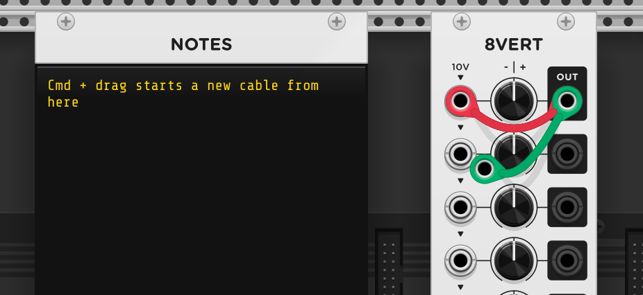
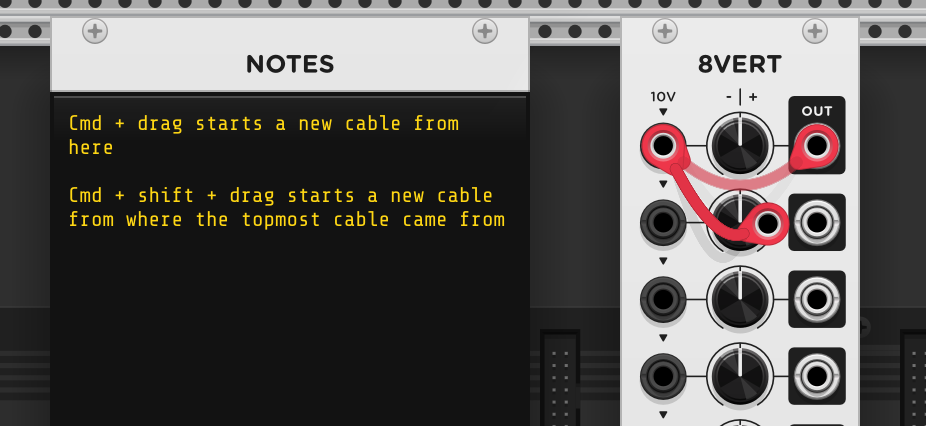

# R for Rack

[Keyboard shortcuts](#keyboard-shortcuts) • [Tips](#tips)

## Keyboard shortcuts

Right click (or <kbd>ENTER</kbd>) opens the module browser. The focus is already
in the search bar, so typing the first few characters of the module name and
pressing <kbd>ENTER</kbd> adds it it to our patch.

Dragging creates a cable.

<kbd>Shift + click</kbd> deletes the topmost cable.

<kbd>Cmd + drag</kbd> creates a new cable _from the  jack_.

<kbd>Cmd + shift + drag</kbd> creates a new cable _from the jack where the
topmost cable is from_.

Note how in this case Rack will retain the cable color (In case of <kbd>Cmd +
drag</kbd> it auto rotates the color, unless you've turned it off in the View
menu).

The easiest way I've found to make a new cable topmost is to go to its other
port and click on it there.

The current / _selected_ module is the one over which the mouse pointer is
currently placed.

* Use <kbd>DEL</kbd> to delete it.

* <kbd>Cmd + D</kbd> to duplicate it.

* <kbd>Cmd + shift + D</kbd> to duplicate it with the cables intact.

* <kbd>Cmd + I</kbd> to (re-)initialize it, resetting it to its default state.

* <kbd>Cmd + F1</kbd> to view its manual.

## Tips

### Stop the engine

There isn't a way to stop the engine, but as a workaround <kbd>Cmd - A</kbd>
(Select all modules) and <kbd>Cmd - E</kbd> (Bypass).
